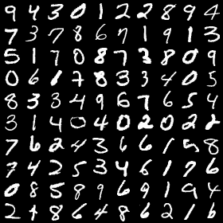
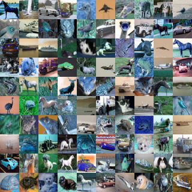
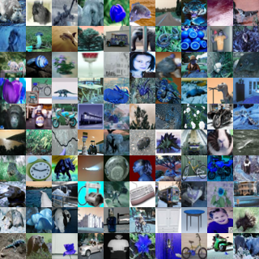
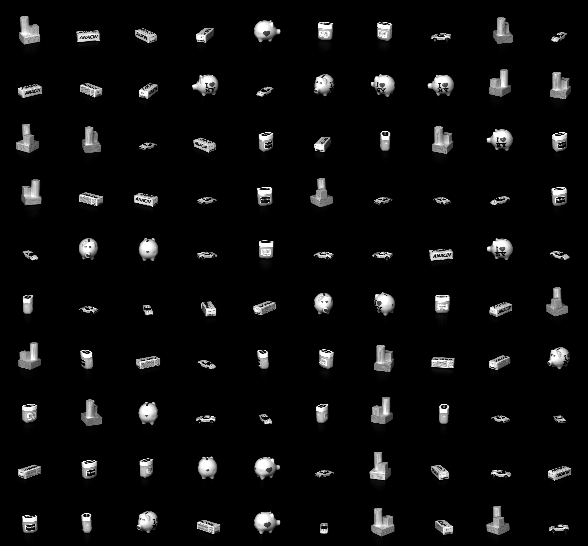
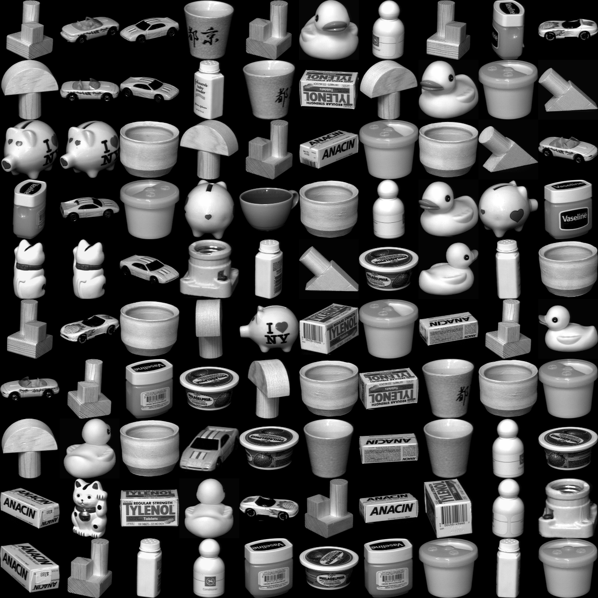
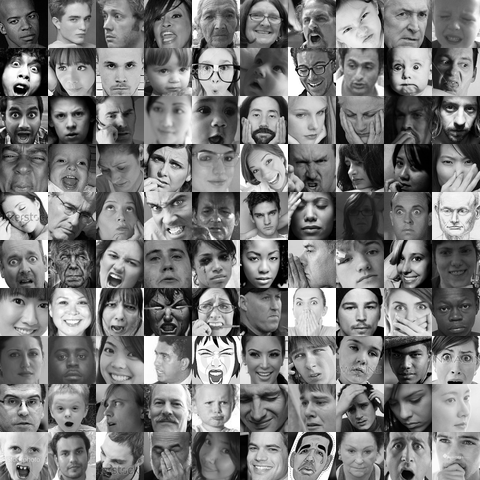

## handle a variety of dataset, the basic idea is just to get the dataset in a convenient way and, most importantly, without any data transformation

## minist:
Get from chainer's dataset module, the resulting images is 0-255 uint8 numpy matrix, saved into pyarrow zero-copy data type

usage:
```python
from dataset.minist.feed import feed
path = "./save/"
feed(feed_path=path)
```
then training data will be stored in ./save/X.pa, the training label will be stored in ./save/Y.pa

to load the data into numpy, try:
```python
from dataset import pa2np
X, Y = pa2np("./save/X.pa"), pa2np("./save/Y.pa")
```
sample of resulting dataset:



## cifar
Get from chainer's dataset moduel, the resulting image is 0-255 uint8 numpy matrix, saved into pyarrow zero-copy data type

usage:

for cifar-10
```python
from dataset.cifar.feed import feed
path = "./save/"
feed(feed_path=path, dataset_type=10)
```
then training data will be stored in ./save/X_10.pa, the training label will be stored in ./save/Y_10.pa

sample of resulting dataset:



for cifar-100
```python
from dataset.cifar.feed import feed
path = "./save/"
feed(feed_path=path, dataset_type=100)
```
then training data will be stored in ./save/X_100.pa, the training label will be stored in ./save/Y_100.pa

sample of resulting dataset:



To load the data, see that in mnist above


## coil-20
the resulting image is 0-255 uint8 numpy matrix, saved into pyarrow zero-copy data type

usage:

for unprocessed
```python
from dataset.coil20.feed import feed
path = "./save/"
feed(feed_path=path, dataset_type='unprocessed')
```
then training data will be stored in ./save/X_unprocessed.pa, the training label will be stored in ./save/Y_unprocessed.pa

sample of resulting dataset:




for processed
```python
from dataset.coil20.feed import feed
path = "./save/"
feed(feed_path=path, dataset_type='processed')
```
then training data will be stored in ./save/X_processed.pa, the training label will be stored in ./save/Y_processed.pa

To load the data, see that in mnist above

sample of resulting dataset:



# kaggle:
below are some kaggle dataset
## fer2013
the resulting image is 0-255 uint8 numpy matrix, saved into pyarrow zero-copy data type

usage:

```python
from dataset.kaggle.fer2013.feed import feed
path = "./save/"
feed(feed_path=path)
```
then training data will be stored in ./save/X.pa, the training label will be stored in ./save/Y.pa

sample of resulting dataset:




## whales2018
the resulting image and correponding label is save into dict object

usage:

```python
from dataset.kaggle.whales2018.feed import feed
path = "./save/"
feed(feed_path=path)
```
